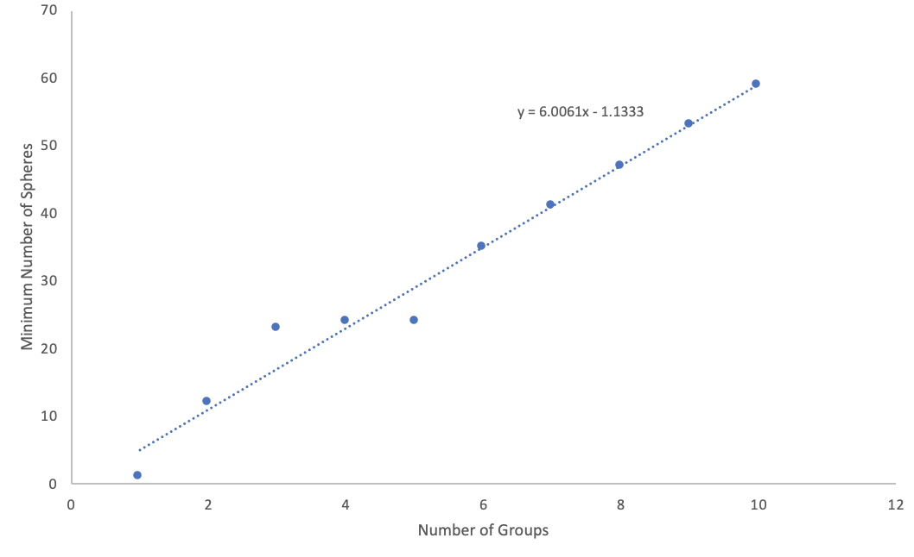
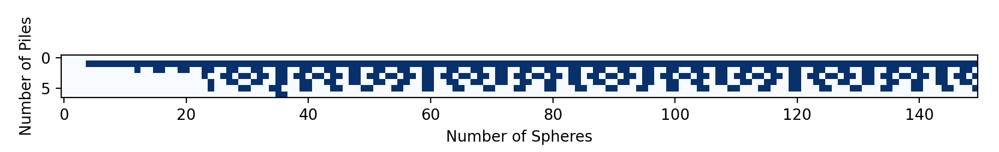

## The 538 Riddler - June 19 2020

The way I am going to do this is to use integer programming to find solutions to this. Specifically, I use OR-Tools to set up a system of constraints that then gets solved. 

Writing the volume of the sphere in terms of diameter out, we note that there is a bunch of constants out front which don't matter for the actual proportioning


What we actually care about is finding the way to group the cubes of the first *S* integers into *N* group such that the sum of each group is equal. Each group can then be multiplied by the constants in front of the volume formula to get the final volume. 

We can formulate this mathematically as


Where *n* is group number, and 𝛿<sub>s,n</sub> is an indicator variable  (e.g. it is zero or one) denoting that *s* is in group *n*. The first equation says that each group must sum the same thing, 1/N of the total volume (ignoring constants).

The second says that each sphere must be represented in exactly one group (recall that the indicator variable is either zero or one)

The grouping problem then becomes finding 𝛿<sub>s,i</sub> for a given *N* and *S*. A solution to this may or may not exist (for example there is no way to do *N*=3, *S*=3)

The problem as stated becomes finding the minimum S for which a solution exists.

## Code
I wrote an solver of the constraints above using OR-Tools. This code has two modes. One mode will both scan over *all* possible combinations of *N* and *S* less than certain bounds to make a plot of which *N*, *S* pairs are possible. The other mode will find the minimun *N*, *S* pair that is possible.

There are a few ways to speed this code up dramatically that I built in

- If the sum of the spheres is not divisible by *N* we immediately know it's not possible to split this evenly
- Always assign the largest sphere to the first group. This breaks the symmetry around group numbering
- If the nth and n-1th sphere volume is larger than the volume of all the spheres divided by the number of piles, they have to be in a separate group. This lets us place some spheres in separate groups and speeds things up considerably. For example, for N=9, S=51, we can place the 5 largest spheres in the first 5 piles, because the addition of two of these would go over the maximum weight of a pile.

I feel like there has to be another, more subtle constraint that I am missing here, but all the other ones I came up with ended up being one of these three in disguise.

This code runs on my laptop pretty well up until N=8, then it really starts to choke, so I got a much larger AWS instance.

## Results

The short answer to the question is that for three children the king has 23 spheres if each child is going to get the same volume of gold, and the king has the minimum number of spheres neccesary for this to happen. If the king has more children this becomes more complicated.

Running this code (on a very large AWS instance), I find

| Number of Piles | Minimum Number of Spheres |
|-----------------|---------------------------|
| 1               | 1                         |
| 2               | 12                        |
| 3               | 23                        |
| 4               | 24                        |
| 5               | 24                        |
| 6               | 35                        |
| 7               | 41                        |
| 8               | 47                        |
| 9               | 53                        |
| 10              | 59                        |
| 11              | 54, 65, 66 or >70         |
| 12              | >59                       |

I foolishly forgot to save the exact groupings for 9 and 10, but the groupings for 1-8 are

11 and 12 only have bounds as they are still running at the time of writing. 


```
Minimum for 1 child is 1 sphere
Pile 1: [1], Total Volume: 0.52 cm^3


Minimum for 2 child piles is 12 spheres
Pile 1: [1, 2, 4, 8, 9, 12], Total Volume: 1592.79 cm^3
Pile 2: [3, 5, 6, 7, 10, 11], Total Volume: 1592.79 cm^3


Minimum for 3 child is 23 spheres
Pile 1: [2, 5, 9, 11, 14, 15, 17, 23], Total Volume: 13295.22 cm^3
Pile 2: [3, 6, 10, 13, 18, 19, 21], Total Volume: 13295.22 cm^3
Pile 3: [1, 4, 7, 8, 12, 16, 20, 22], Total Volume: 13295.22 cm^3


Minimum for 4 child is 24 spheres
Pile 1: [1, 2, 3, 4, 14, 18, 24], Total Volume: 11780.97 cm^3
Pile 2: [7, 9, 21, 23], Total Volume: 11780.97 cm^3
Pile 3: [5, 6, 12, 13, 15, 19, 20], Total Volume: 11780.97 cm^3
Pile 4: [8, 10, 11, 16, 17, 22], Total Volume: 11780.97 cm^3


Minimum for 5 child is 24 spheres
Pile 1: [2, 4, 9, 15, 24], Total Volume: 9424.78 cm^3
Pile 2: [1, 18, 23], Total Volume: 9424.78 cm^3
Pile 3: [8, 14, 16, 22], Total Volume: 9424.78 cm^3
Pile 4: [3, 5, 12, 19, 21], Total Volume: 9424.78 cm^3
Pile 5: [6, 7, 10, 11, 13, 17, 20], Total Volume: 9424.78 cm^3


Minimum for 6 child is 35 spheres
Pile 1: [11, 12, 16, 19, 21, 35], Total Volume: 34636.06 cm^3
Pile 2: [8, 13, 14, 17, 18, 22, 34], Total Volume: 34636.06 cm^3
Pile 3: [2, 3, 9, 24, 25, 33], Total Volume: 34636.06 cm^3
Pile 4: [1, 5, 27, 28, 29], Total Volume: 34636.06 cm^3
Pile 5: [6, 15, 31, 32], Total Volume: 34636.06 cm^3
Pile 6: [4, 7, 10, 20, 23, 26, 30], Total Volume: 34636.06 cm^3


Minimum for 7 child is 41 spheres
Pile 1: [8, 13, 20, 22, 25, 41], Total Volume: 55450.68 cm^3
Pile 2: [2, 10, 12, 23, 30, 40], Total Volume: 55450.68 cm^3
Pile 3: [4, 21, 26, 27, 39], Total Volume: 55450.68 cm^3
Pile 4: [7, 16, 24, 32, 38], Total Volume: 55450.68 cm^3
Pile 5: [3, 11, 28, 33, 36], Total Volume: 55450.68 cm^3
Pile 6: [5, 6, 9, 29, 31, 37], Total Volume: 55450.68 cm^3
Pile 7: [1, 14, 15, 17, 18, 19, 34, 35], Total Volume: 55450.68 cm^3


Minimum for 8 child is 47 spheres
Pile 1: [10, 18, 25, 32, 47], Total Volume: 83277.34 cm^3
Pile 2: [4, 26, 27, 29, 46], Total Volume: 83277.34 cm^3
Pile 3: [12, 15, 23, 37, 45], Total Volume: 83277.34 cm^3
Pile 4: [13, 14, 16, 28, 35, 44], Total Volume: 83277.34 cm^3
Pile 5: [1, 3, 8, 17, 42, 43], Total Volume: 83277.34 cm^3
Pile 6: [2, 5, 6, 19, 24, 31, 34, 41], Total Volume: 83277.34 cm^3
Pile 7: [7, 11, 21, 22, 33, 36, 38], Total Volume: 83277.34 cm^3
Pile 8: [9, 20, 30, 39, 40], Total Volume: 83277.34 cm^3
```

We can plot this, and see that it kinda looks linear-ish which gives us a guess that 11 piles will need around 65 spheres, and 12 piles will need around 71 spheres.

Coincidentally, both 65 and 66 have not been ruled out as candidates for N=11 (and I haven't looked >70) which means that our linear relation might hold for 11 as well.

## Going beyond the minimum
What about the split-ability of S greater than the minimum? The script also scan a range of S's. If we plot them up to N=6, S=39. we see




Here blue indicaes that the Pile/Spheres combination *is* possible. We can see that there is definitel some periodicity there!